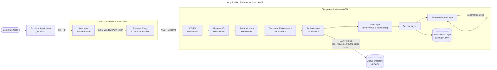
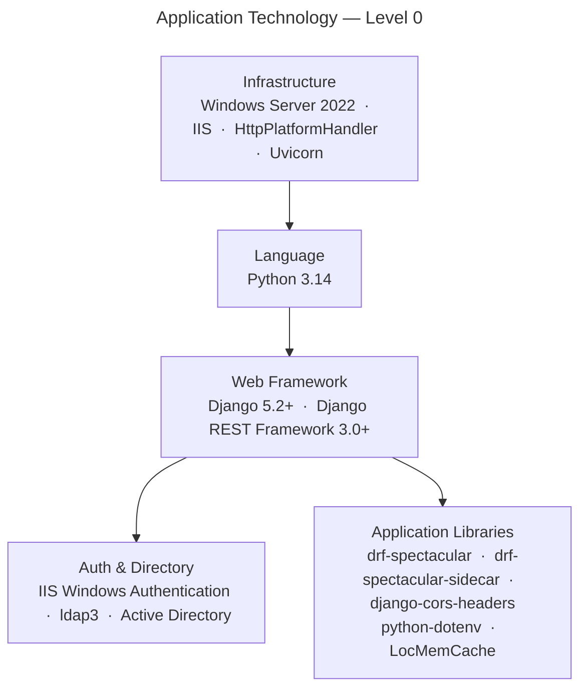
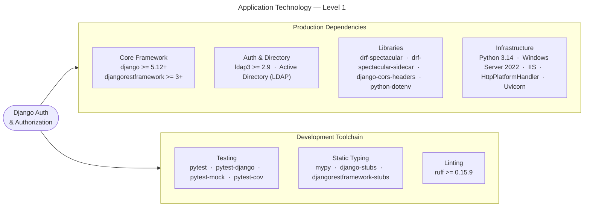
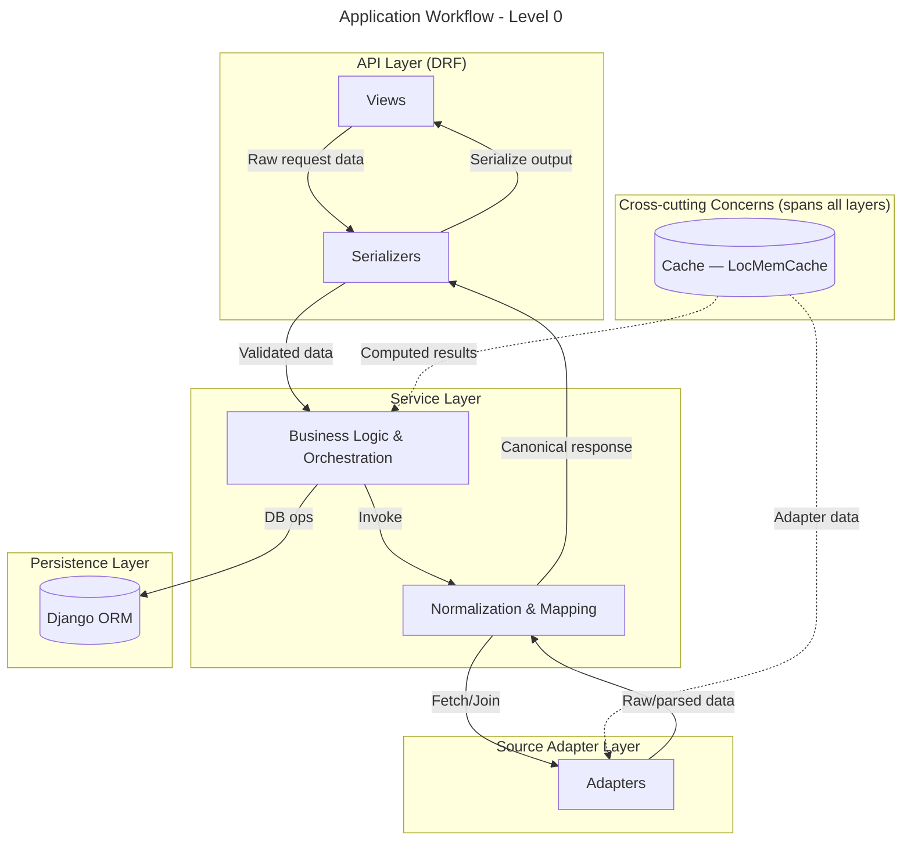
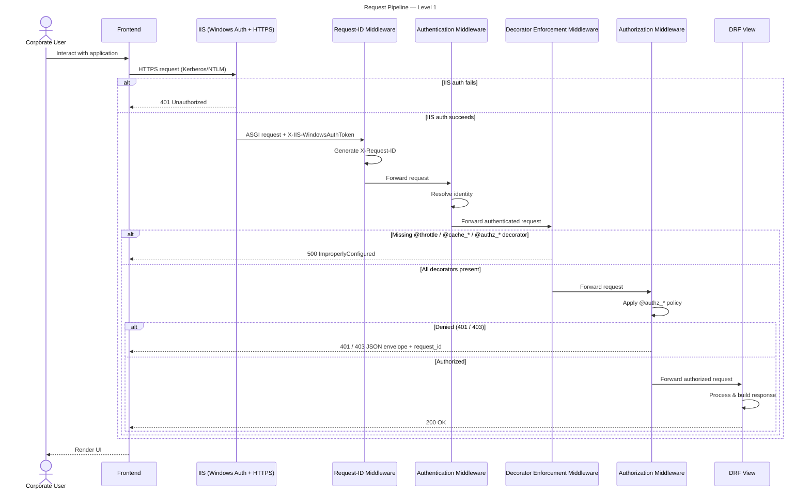
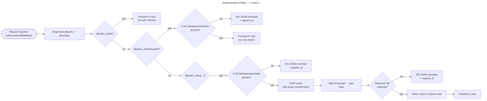
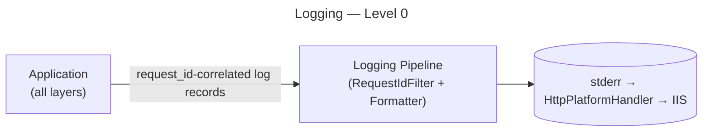
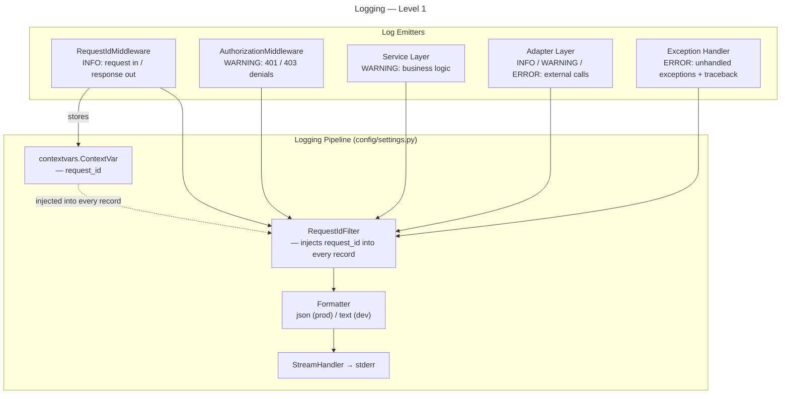
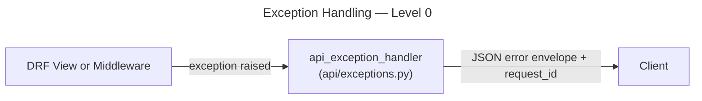
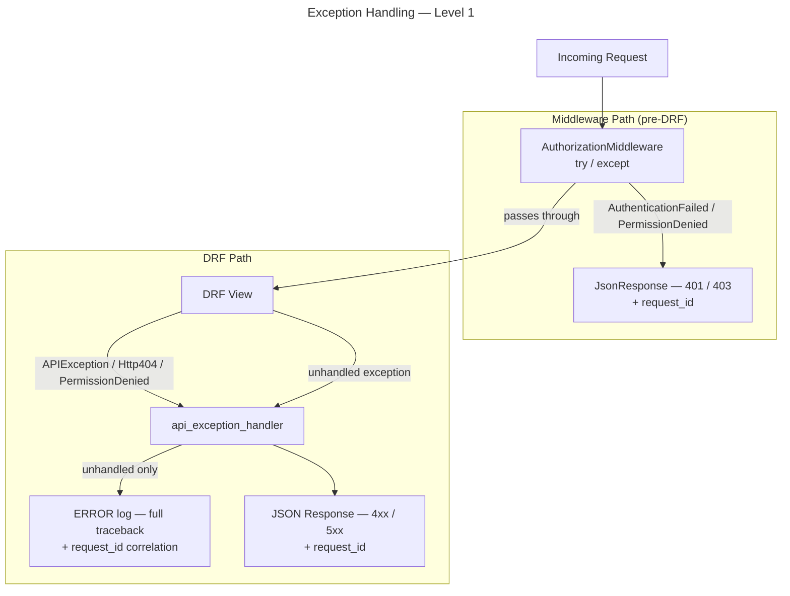

# Django Authentication & Authorization

*A minimal Django web application designed for use within corporate enterprise to be deployed specifically to Windows servers that uses IIS for Authentication and Activate Directory for Authorization. Able to scale and extend for a multitude of use cases by utilizing the Adapter pattern.*

## Table of Contents
- [Requirement](#requirement)
- [Design](#design)
    - [Application Architecture Diagram](#application-architecture-diagram)
    - [Application Technology](#application-technology)
    - [Workflow](#workflow)
    - [Structure](#structure)
    - [Endpoints](#endpoints)
    - [Logging](#logging)
    - [Exception Handling](#exception-handling)
    - [Caching](#caching)
    - [Rate Limiting](#rate-limiting)
    - [Automated Testing Strategy](#automated-testing-strategy)
    - [Local Development](#local-development)
- [Deployment](#deployment)

## Requirement

- Must run on Windows Server 2022.
- Must use `Python==3.14` & `Django==5.2.13`.
- Must integrate with the `djangorestframework>=3.0.0`.
- Must integrate with `drf-spectacular` for provision of API documentation.
- The application must use Windows Authentication via IIS, integrating directly with Active Directory for user authentication. 
- All authentication must be handled by IIS; the application will not implement its own login or token validation. User identity is provided to the backend via IIS environment variables or headers.
- For authorization, the application must query Active Directory via LDAP to determine user group membership and map to application roles.
    - Specifically `ldap3>=2.9`.
    - LDAP group membership is queried on every request that requires role-based authorization. Results are **not cached** — AD group changes (additions, removals, disablement's) must take immediate effect for security.
    - Users not in a configured group are to be denied access to the application.
- Must integrate with `python-dotenv` for loading environment variables from `.env` files.
- Must integrate with `django-cors-headers` for Cross-Origin Resource Sharing (CORS) support, enabling both same-origin and cross-origin frontend deployments.
- All packages must be available through **Anaconda**, prioritizing the `conda-forge` channel.
    - `django-auth-ldap`, `python-ldap` & `django-auth-adfs` cannot be used as these are not readily available for `Windows` on `conda-forge`.
- All technologies used must be license free for corporate use.
- The application must support local development and testing without IIS/AD/LDAP.
- All code must have 100% test coverage using the `pytest` testing harness and Django specific testing libraries are required.
- All code must be statically typed using the `MyPy` library.
- The application is to be scope to include the below roles in its current state, with a clear method for adding further roles:
    - `app_admin`
    - `app_viewer`
- The application must provide a global: Logging, Error, Exception and Rate Limiting solution.
- The application must offer a server side caching solution.

---

## Design

*Design intention is to use the `Representational State Transfer (REST)` protocol to provide `Backend-for-Frontend (BFF)` endpoints as the primary API style for the application. All authentication and authorization needs are handled by IIS using Windows Authentication and Active Directory. The backend receives user identity via IIS-injected `X-IIS-WindowsAuthToken` HTTP header. The application is served via ASGI (using Uvicorn under IIS HttpPlatformHandler in production). HTTPS is enforced at the IIS layer; the Django application assumes all traffic is TLS-terminated by the reverse proxy. CSRF middleware remains enabled in Django, while DRF session authentication is disabled so API authentication and authorization remain middleware-driven via IIS identity headers. CORS is managed via `django-cors-headers`, supporting both same-origin deployments (where the frontend is served by the same IIS instance) and cross-origin deployments (where the frontend is hosted separately).*

Frontend role state is explicitly **non-authoritative**. Users can modify browser state (for example via DevTools) and force UI-only role flags that reveal hidden menus or pages. This must never grant API access by itself. All authorization decisions are made server-side from middleware-resolved identity and AD group membership, and all sensitive data must be fetched from role-protected endpoints rather than embedded in frontend bundles.

### Application Architecture Diagram




### Application Technology





### Workflow

1. API Layer (`Django REST Framework (DRF)`)
    - Exposes stable endpoints as DRF `APIView` subclasses, with a thin shared `api/views/base.py::BaseAPIView` providing common request-user helpers.
    - Every endpoint provides explicit schema metadata (via `serializer_class` or `@extend_schema`) so `drf-spectacular` can generate a complete OpenAPI document, including simple JSON endpoints such as `/api/health/` and `/api/user/`.
    - Relies on the custom `api.middleware.authentication.AuthenticationMiddleware` to resolve the IIS-provided `X-IIS-WindowsAuthToken` into a Django `User`, or attach `AnonymousUser` when no identity is present.
    - Uses `ldap3` library to query Active Directory for group membership on every `@authz_roles` request. Results are not cached — AD changes take immediate effect.
    - Maps AD group membership to Django user roles for authorization (e.g., admin access).
    - Treats frontend role flags as presentation hints only. Backend authorization never trusts client-supplied role values.
    - Every view must explicitly apply all three decorator families: authorization (`@authz_*`), rate limiting (`@throttle` / `@throttle_exempt`), and cache policy (`@cache_*`). This is enforced by middleware, and missing decorators raise `ImproperlyConfigured`.
    - All unhandled exceptions in DRF views are caught by the custom exception handler (`api/exceptions.py`), which logs the error and returns a standardized error envelope with `request_id` correlation. No per-view `try/except` blocks are needed.
    - Per-request access logging (method, path, status, duration, user) is handled by `RequestIdMiddleware`. Views do not implement their own request/response logging.

1. Service Layer
    - Implements business workflows.
    - Orchestrates internal DB operations and/or external source reads.
    - Transforms and normalizes external/internal payloads into canonical response objects for the UI.
    - Uses standard Python logging (`logging.getLogger(__name__)`); request-ID correlation is automatic via the context variable and logging filter.
    - Raises DRF `APIException` subclasses for expected error conditions (e.g., business rule violations). Unexpected exceptions propagate to the exception handler, which logs and returns a safe 500.
    - Can cache computed results via Django's cache framework using the `service:{domain}:{operation}:{hash}` key convention.

1. Source Adapter Layer
    - One adapter per external source.
    - Handles source-specific authentication, request/response contracts, retries, and error mapping.
    - Performs minimal parsing: converts raw responses to native Python structures, handles protocol-level details, and validates required fields, but does not apply business rules or normalization (handled in the application & mapping layer).
    - Logs external call lifecycle (start, response status, retries, failures) at appropriate levels (`INFO` / `WARNING` / `ERROR`). Request-ID correlation is automatic.
    - Caches external responses via Django's cache framework with source-appropriate TTLs, using the `adapter:{source}:{resource}:{id}` key convention.
    - Raises standard Python exceptions on failure. The exception handler catches these, logs the traceback, and returns a safe 500 response.

1. Persistence Layer (`Django ORM`)
    - Uses Django models and migrations for internal schema evolution.
    - Keeps write operations limited to app-owned internal tables.
    - Service-layer writes explicitly invalidate related cache keys after successful database commits (write-through invalidation pattern).







---

### Structure

The `api` Django app is organized into domain-aligned packages that mirror the layered architecture detailed above.

```
backend/
├── api/
│   ├── __init__.py
│   ├── apps.py
│   ├── cache_keys.py
│   ├── caching.py
│   ├── constants.py
│   ├── exceptions.py
│   ├── middleware/
│   │   ├── __init__.py
│   │   ├── authentication.py
│   │   ├── authorization.py
│   │   ├── enforcement.py
│   │   ├── request_id.py
│   │   └── content_security_policy.py
│   ├── models.py
│   ├── permissions.py
│   ├── request_user.py
│   ├── security_logging.py
│   ├── serializers/
│   │   ├── __init__.py
│   │   ├── health_serializer.py
│   │   └── user_serializer.py
│   ├── services/
│   │   └── __init__.py
│   ├── throttling.py
│   ├── urls.py
│   ├── validation.py
│   ├── views/
│   │   ├── __init__.py
│   │   ├── base.py
│   │   ├── docs.py
│   │   ├── health.py
│   │   └── user.py
│   ├── adapters/
│   │   └── __init__.py
│   └── migrations/
├── config/
│     ├── __init__.py
│     ├── logging.py
│     ├── pytest_settings.py
│     ├── settings.py
│     └── urls.py
├── tests/
│   ├── __init__.py
│   ├── conftest.py
│   ├── api/
│   │   ├── middleware/
│   │   │   ├── __init__.py
│   │   │   ├── test_authentication.py
│   │   │   ├── test_authorization.py
│   │   │   ├── test_enforcement.py
│   │   │   └── test_request_id.py
│   │   ├── views/
│   │   │   ├── __init__.py
│   │   │   ├── test_health.py
│   │   │   ├── test_schema.py
│   │   │   └── test_user.py
│   │   ├── test_apps.py
│   │   ├── test_cache_key_enforcement.py
│   │   ├── test_cache_keys.py
│   │   ├── test_caching.py
│   │   ├── test_exceptions.py
│   │   ├── test_permissions.py
│   │   ├── test_security_logging.py
│   │   ├── test_validation.py
│   │   ├── test_view_base_class.py
│   │   ├── test_throttling.py
│   │   └── test_view_decorator_order.py
│   └── config/
│       ├── __init__.py
│       ├── test_logging.py
│       └── test_settings.py
├── .env.example
├── manage.py
├── mypy.ini
├── pytest.ini
├── pyproject.toml
└── environment.yml
```

**Package responsibilities:**

| File/Package                        | Layer                | Responsibility |
|-------------------------------------|----------------------|----------------|
| `api/`                              | All backend layers   | Main Django app (see below for subfolders) |
| `api/apps.py`                       | API                  | Django app config with startup security guard (validates AUTH_MODE and DEBUG settings) |
| `api/cache_keys.py`                 | Cross-cutting        | Shared cache key builders and guardrails for adapter, service, and view caches |
| `api/constants.py`                  | Cross-cutting        | Role definitions (ROLE_ADMIN, ROLE_VIEWER), AD group-to-role mapping |
| `api/validation.py`                 | Cross-cutting        | Strict allowlist validation for hosts, origins, LDAP URIs/DNs, usernames, API versions, log formats, and log levels |
| `api/exceptions.py`                 | Cross-cutting        | Custom DRF exception handler — standardises all error responses and logs exceptions with request-ID correlation |
| `api/models.py`                     | Persistence          | ORM models |
| `api/middleware/`                   | API/Cross-cutting    | Middleware package (see below) |
| `api/middleware/request_id.py`      | Cross-cutting        | Request-ID injection middleware and correlated access logging |
| `api/middleware/authentication.py`  | API                  | Resolves `X-IIS-WindowsAuthToken` into a Django `User` in IIS mode and injects a mock identity in dev mode; attaches `AnonymousUser` when unauthenticated and preserves `_cached_user` for DRF wrappers |
| `api/middleware/enforcement.py`    | API/Cross-cutting    | Decorator enforcement — ensures every view declares `@throttle`/`@cache_*`/`@authz_*` decorators |
| `api/middleware/authorization.py`   | API                  | LDAP group membership lookup, role mapping, and access control |
| `api/middleware/content_security_policy.py` | Cross-cutting | Response middleware that injects the strict Content-Security-Policy header |
| `api/urls.py`                       | API                  | URL routing to views package |
| `api/views/`                        | API                  | DRF `APIView` request handling, response shaping, and schema metadata |
| `api/views/base.py`                 | API                  | Thin shared `BaseAPIView` for common request-user helpers and base view structure |
| `api/views/health.py`               | API                  | Health check `APIView` with explicit response serializer metadata |
| `api/views/docs.py`                 | API                  | Wrapper views for schema/docs endpoints with explicit auth policy and shared base inheritance |
| `api/views/user.py`                 | API                  | User identity and role `APIView` |
| `api/permissions.py`                | API/Cross-cutting    | Per-view authorization permission decorators (`@authz_public`, `@authz_authenticated`, `@authz_roles`) |
| `api/caching.py`                    | Cross-cutting        | `@cache_public`, `@cache_private`, `@cache_disabled` decorators — per-view HTTP cache-control policy with enforcement via middleware |
| `api/throttling.py`                 | Cross-cutting        | `@throttle` and `@throttle_exempt` decorators — per-view, per-user rate limiting with explicit rate strings; `RemoteUserRateThrottle` keyed on `X-IIS-WindowsAuthToken` identity |
| `api/security_logging.py`           | Cross-cutting        | Structured security event field builders for authentication, authorization, validation, throttling, access, and exception logs |
| `api/serializers/`                  | API                  | Serializer package and export surface |
| `api/serializers/health_serializer.py` | API               | Health endpoint response serializer (`HealthSerializer`) |
| `api/serializers/user_serializer.py`| API                  | User identity/roles response serializer (`UserSerializer`) |
| `api/request_user.py`               | Cross-cutting        | Helper for resolving the middleware-attached request user across DRF wrappers and request logging |
| `api/services/`                     | Service              | Business logic, orchestration, state machines, normalization & mapping |
| `api/adapters/`                     | Source Adapter       | External data-source access with resilience patterns |
| `api/migrations/`                   | Persistence          | Django migration history |
| `config/`                           | Cross-cutting        | Django and app configuration (settings, ASGI, logging, etc.) |
| `config/logging.py`                 | Cross-cutting        | `JsonFormatter` — custom `logging.Formatter` subclass for UTC JSON output and structured security fields |
| `config/pytest_settings.py`         | Cross-cutting        | Test-only settings bootstrap that loads `.env.example` before importing base settings |
| `tests/`                            | Cross-cutting        | Automated test suite (`pytest`) mirroring source structure |
| `tests/conftest.py`                 | Cross-cutting        | Shared pytest fixtures and test configuration |
| `tests/api/`                        | API/Cross-cutting    | API-layer unit and integration tests, including schema and decorator guardrails |
| `tests/api/test_view_base_class.py` | API/Cross-cutting    | Guardrail tests for shared `BaseAPIView` inheritance and serializer metadata |
| `tests/api/test_security_logging.py` | Cross-cutting        | Structured security logging helper tests |
| `tests/api/test_validation.py`      | Cross-cutting        | Validation helper tests for allowlists and fail-fast config |
| `tests/api/middleware/`             | API/Cross-cutting    | Middleware tests (authentication, authorization, enforcement, request-id) |
| `tests/api/views/`                  | API                  | Endpoint behavior tests (`health`, `schema/docs`, `user`) |
| `tests/config/`                     | Cross-cutting        | Config/module tests (`settings`, `asgi`, `logging`) |

---

### Endpoints

**Get Health** (`GET /api/health/`)

Returns the application status, API version, and process uptime. This endpoint is unauthenticated and publicly accessible — no `X-IIS-WindowsAuthToken` or role membership is required. Intended for use by load balancers, uptime monitors, and IIS health probes. The release pipeline replaces the `APP_VERSION` placeholder in `.env` with the tagged release version.

Implementation note: this endpoint is implemented as a DRF `APIView`, is explicitly marked with `@authz_public`, and declares response serializer metadata so it appears in `drf-spectacular`.

| Property        | Value                      |
|-----------------|----------------------------|
| Method          | `GET`                      |
| URL             | `/api/health/`             |
| Authentication  | None                       |
| Authorization   | None                       |
| View            | `api/views/health.py`      |

*Response* `200 OK`
```json
{
    "status": "ok",
    "version": "APP_VERSION",
    "uptime_seconds": 1234
}
```

---

**Get User** (`GET /api/user/`)

Returns the authenticated user's identity and assigned roles. Requires a valid `X-IIS-WindowsAuthToken` (provided by IIS in production or injected by dev-mode middleware locally). The authorization middleware resolves the user's AD group memberships (via LDAP, queried per-request) and maps them to application roles before the request reaches this view.

Designed to be called by the frontend on initial load to populate a context provider (`UserContext`) or state store (e.g., Redux slice / Zustand store). The response shape is intentionally flat and self-contained so the frontend can store it directly without transformation.

Implementation note: this endpoint is implemented as a DRF `APIView` and declares response serializer metadata so it appears in `drf-spectacular`.

| Property        | Value                      |
|-----------------|----------------------------|
| Method          | `GET`                      |
| URL             | `/api/user/`               |
| Authentication  | IIS (`X-IIS-WindowsAuthToken`)        |
| Authorization   | Any configured role (`app_admin` or `app_viewer`) |
| View            | `api/views/user.py`        |

*Response* `200 OK`
```json
{
    "username": "DOMAIN\\jsmith",
    "roles": ["app_viewer"]
}
```

| Field      | Type       | Description |
|------------|------------|-------------|
| `username` | `string`   | The `X-IIS-WindowsAuthToken` identity as provided by IIS (typically `DOMAIN\username`). |
| `roles`    | `string[]` | Application roles derived from AD group membership. One or more of: `app_admin`, `app_viewer`. |

*Response* `401 Unauthorized` — No `X-IIS-WindowsAuthToken` header present (IIS auth not configured or request not authenticated).
```json
{
    "detail": "Authentication credentials were not provided.",
    "request_id": "a1b2c3d4-e5f6-7890-abcd-ef1234567890"
}
```

*Response* `403 Forbidden` — User is authenticated but is not a member of any configured AD group.
```json
{
    "detail": "You do not have permission to perform this action.",
    "request_id": "a1b2c3d4-e5f6-7890-abcd-ef1234567890"
}
```

---

**API Schema** (`GET /api/schema/`)
- Serves the OpenAPI 3 schema generated by `drf-spectacular`.
- Requires IIS authentication (any domain user) but no specific application role.
- Implemented via `api/views/docs.py` wrapper view marked `@authz_authenticated`.

*Response* `401 Unauthorized` — No `X-IIS-WindowsAuthToken` header present.
```json
{
    "detail": "Authentication credentials were not provided.",
    "request_id": "a1b2c3d4-e5f6-7890-abcd-ef1234567890"
}
```

**API Documentation** (`GET /api/docs/`)
- Serves the interactive Swagger UI for exploring and testing endpoints.
- Uses bundled `drf-spectacular-sidecar` assets plus a local template/static override so the page works without CDN access or inline assets, keeping the CSP strict.
- Requires IIS authentication (any domain user) but no specific application role.
- Implemented via `api/views/docs.py` wrapper view built on `SpectacularSwaggerSplitView` and marked `@authz_authenticated`.

*Response* `401 Unauthorized` — No `X-IIS-WindowsAuthToken` header present.
```json
{
    "detail": "Authentication credentials were not provided.",
    "request_id": "a1b2c3d4-e5f6-7890-abcd-ef1234567890"
}
```
---

### Logging

*Structured, correlated logging is essential for enterprise operations — incident triage, security audits, and performance analysis all depend on it. The logging design is deliberately minimal: it provides the infrastructure (configuration, correlation, formatting) so that every module added downstream automatically participates in the same logging pipeline without additional setup.*


#### Design Principles

1. **Request-ID correlation** — Every log record automatically includes the `X-Request-ID` generated by `RequestIdMiddleware`. This allows ops teams to trace a single user request across all log lines, middleware layers, adapter calls, and background tasks.
2. **Structured JSON in production** — Production logs are emitted as single-line JSON objects for consistent, machine-parseable output. This simplifies `grep`/`findstr` filtering, integration with Windows Event Forwarding, and future adoption of log aggregation tooling. Development mode uses human-readable console output.
3. **Per-request access log** — Every HTTP request/response pair is logged once with method, path, status code, duration (ms), user identity, source IP, user agent, and request-ID. This replaces the need for IIS access logs at the Django layer and provides richer context for operations and incident triage.
4. **Security audit trail** — Authentication failures, authorization denials, validation failures, rate-limit denials, and unhandled exceptions emit typed security events via `api.security_logging.py` with structured fields (user, IP, user agent, resource, status code, duration where applicable).
5. **No sensitive data in logs** — Request bodies, passwords, tokens, and PII beyond the username should never be logged. The `X-IIS-WindowsAuthToken` header value (corporate username) is the only identity field included.
6. **No duplicate runserver access log** — Django's built-in `django.server` request logger is silenced so the middleware-owned access log is the single request log line during local development.


#### Configuration

Logging is configured via Django's `LOGGING` dict in `config/settings.py`, using Python's standard `logging.config.dictConfig` schema.

| Component | Dev mode (`AUTH_MODE=dev`) | Production (`AUTH_MODE=iis`) |
|-----------|---------------------------|------------------------------|
| Format | Human-readable: `[level] request_id message` | JSON: `{"timestamp" (UTC ISO 8601), "level", "request_id", "logger", "message", security fields}` |
| Handler | Console (`StreamHandler` to stderr) | Console (`StreamHandler` to stderr, captured by IIS/HttpPlatformHandler) |
| Root level | `DEBUG` | `WARNING` |
| `api` logger level | `DEBUG` | `INFO` |
| `django` logger level | `INFO` | `WARNING` |

The JSON formatter is a lightweight custom `logging.Formatter` subclass in `config/logging.py` (no external dependencies). It emits UTC ISO 8601 timestamps and propagates the structured fields defined in `api.security_logging.SECURITY_EXTRA_FIELDS`, defaulting `request_id` to `"-"` when no request context is available (e.g., startup, management commands). Keeping it separate from `settings.py` allows it to be instantiated and tested in isolation without triggering settings validation.

#### Request-ID Threading

The `RequestIdMiddleware` already generates `X-Request-ID` and attaches it to `request.request_id`. To make this available to all loggers without explicit passing:

- The middleware stores the request ID in a **context variable** (`contextvars.ContextVar`), which is thread-safe and async-safe.
- A **logging filter** (`api/middleware/request_id.py::RequestIdFilter`) reads the context variable and injects `request_id` into every log record.
- The filter is attached to all handlers in the `LOGGING` config, so every log line — from middleware, views, services, adapters, or Django internals — automatically carries the correlation ID.

#### Security Event Types

| Event Type | Emitted By | When | Core Fields |
|------------|------------|------|-------------|
| `ACCESS` | `RequestIdMiddleware` | Every request/response pair | method, path, status code, duration, user, source IP, user agent |
| `AUTHENTICATION_SUCCESS` | `AuthenticationMiddleware` | Valid `X-IIS-WindowsAuthToken` or `DEV_USER_IDENTITY` resolved | user, source IP, user agent |
| `AUTHENTICATION_FAILURE` | `AuthorizationMiddleware` | Request lacks identity | user (anonymous), requested resource, status code |
| `AUTHORIZATION_FAILURE` | `AuthorizationMiddleware` | Authenticated user lacks required role | user, requested resource, status code |
| `INPUT_VALIDATION_FAILURE` | `AuthenticationMiddleware`, `api.exceptions` | Invalid username, origin, LDAP value, or serializer validation error | request ID, user, resource, status code |
| `RATE_LIMIT_TRIGGERED` | `api.throttling` | `429 Too Many Requests` emitted | user, requested resource, status code |
| `UNHANDLED_EXCEPTION` | `api.exceptions`, `AuthorizationMiddleware` | Unhandled exception escapes the view or middleware boundary | exception type, request ID, status code |

#### Where Logging Happens

| Layer | What is logged | Level |
|-------|---------------|-------|
| `RequestIdMiddleware` | Request received/completed with method, path, status, duration, user, source IP, and user agent | `INFO` |
| `AuthenticationMiddleware` | Authentication success, invalid identity validation failures | `INFO` / `WARNING` |
| `AuthorizationMiddleware` | Authentication failures, authorization denials, and unhandled authz exceptions | `WARNING` / `ERROR` |
| `api/exceptions.py` | Validation failures and unhandled exceptions caught by the DRF exception handler | `WARNING` / `ERROR` |
| `api/security_logging.py` | Structured security event field assembly and normalization for downstream loggers | `N/A` |
| `config/logging.py` | UTC ISO 8601 JSON formatting and security field propagation | `N/A` |
| Service Layer | Business logic warnings, validation failures | `WARNING` |
| Adapter Layer | External call start, response status, retry attempts, failures | `INFO` / `WARNING` / `ERROR` |



#### Log Rotation

The application does not manage log files directly. Both dev and production handlers are `StreamHandler` writing to **stderr** — no `FileHandler` is used. In production under IIS/HttpPlatformHandler, stderr output is captured by the HttpPlatformHandler process and routed to IIS's logging infrastructure. Log file rotation is managed at the IIS layer via **IIS Manager → Logging → Log File Rollover** (schedule-based or size-based). No Django-side rotation configuration is needed.

#### How This Scales

When new modules are added downstream (services, adapters, views), use Python's standard `logging.getLogger(__name__)`. The request-ID filter ensures correlation is automatic. No logging boilerplate is required beyond:

```python
import logging
logger = logging.getLogger(__name__)
logger.info("Fetched %d records from ERP adapter", count)
```

The hierarchical logger name (`api.adapters.erp`) inherits the `api` logger's level and handlers, so new modules participate in the logging pipeline with zero configuration.

---

### Exception Handling

*A centralised exception handler ensures every error response has a consistent shape, is logged with full context, and never leaks internal details to the client. This is critical for enterprise CRUD applications where adapter failures, database errors, and validation issues must all be surfaced predictably to the frontend.*


#### Design Principles

1. **Single error envelope** — Every 4xx and 5xx response uses the same JSON shape. The frontend can implement one error-handling path regardless of which endpoint or layer produced the error.
2. **Request-ID in every error response** — The `request_id` field lets frontend teams and support staff quote a correlation ID in bug reports. Ops can then search logs for that exact request.
3. **No internal details leaked** — Stack traces, database errors, and adapter exception messages are logged server-side at `ERROR` level but never included in the response body. The client receives only a safe, generic message for 5xx errors.
4. **DRF integration** — Wired as the custom `EXCEPTION_HANDLER` in `REST_FRAMEWORK` settings. Catches all exceptions raised within DRF views (including serializer validation errors) and exceptions re-raised by middleware.
5. **Structured security logging** — Validation failures, authentication failures, authorization denials, rate-limit denials, and unhandled exceptions emit typed security events through `api.security_logging.py` so operators can search by event name and request-ID without parsing free-form messages.


#### Error Response Contract

All error responses conform to this shape:

```json
{
    "detail": "Human-readable error description.",
    "request_id": "a1b2c3d4-e5f6-7890-abcd-ef1234567890"
}
```

| Field | Type | Description |
|-------|------|-------------|
| `detail` | `string` | A safe, client-facing error message. For validation errors, this may be a structured object with field-level messages (matching DRF's default serializer error shape). |
| `request_id` | `string` | The `X-Request-ID` for this request, for correlation with server logs. |

Standard HTTP status codes and their `detail` values:

| Status | `detail` | When |
|--------|----------|------|
| `400` | Field-specific validation errors (DRF default shape) | Serializer validation failure |
| `401` | `"Authentication credentials were not provided."` | No `X-IIS-WindowsAuthToken` / unauthenticated |
| `403` | `"You do not have permission to perform this action."` | Authenticated but lacks required role |
| `404` | `"Not found."` | URL does not match any route, or object lookup failed |
| `405` | `"Method '{method}' not allowed."` | HTTP method not supported by the view |
| `429` | `"Request was throttled. Expected available in {wait} second(s)."` | Rate limit exceeded (DRF throttling) |
| `500` | `"An unexpected error occurred."` | Unhandled exception (details logged server-side only) |

#### Configuration

The exception handler lives in `api/exceptions.py` and is a single function:

```python
def api_exception_handler(exc, context):
```

It delegates to DRF's default `exception_handler` first (which handles `APIException` subclasses and Django's `Http404` / `PermissionDenied`). If the default handler returns a response, the handler enriches it with `request_id`. If the default handler returns `None` (unhandled exception), the handler:

1. Logs the full traceback at `ERROR` level with request-ID correlation.
2. Returns a generic `500` response with `"An unexpected error occurred."` and the `request_id`.

This is wired via:
```python
REST_FRAMEWORK = {
    "EXCEPTION_HANDLER": "api.exceptions.api_exception_handler",
    ...
}
```

#### Middleware Exception Handling

The authorization middleware catches `AuthenticationFailed` and `PermissionDenied` in its own `try/except` and returns `JsonResponse` directly. The middleware runs *before* DRF's view layer, so the DRF exception handler does not apply there. Those middleware paths emit `AUTHENTICATION_FAILURE` and `AUTHORIZATION_FAILURE` security events with request metadata. The DRF exception handler covers serializer validation errors and unhandled exceptions, which are logged as `INPUT_VALIDATION_FAILURE` and `UNHANDLED_EXCEPTION` respectively. Both paths produce the same error envelope shape, including `request_id`.



#### How This Scales

As CRUD views, services, and adapters are added downstream:

- **Serializer validation errors** (400) are handled automatically by DRF — the exception handler enriches them with `request_id`.
- **Object not found** (`get_object_or_404`) produces a 404 with the standard envelope — no custom handling needed.
- **Adapter failures** (e.g., external API timeout) — adapters raise standard Python exceptions. The exception handler catches them, logs the traceback, and returns a safe 500. For adapter-specific error codes (e.g., "upstream unavailable"), teams can raise custom `APIException` subclasses with appropriate status codes and the handler will format them consistently.
- **Service-layer validation** — services that detect business rule violations can raise `DRF ValidationError` or `PermissionDenied`, and the handler formats them identically to view-level errors.

No per-view `try/except` blocks are needed. The handler is the single funnel for all error responses.

---

### Caching

*Server-side caching reduces latency, database load, and external API call volume. The caching design provides a production-ready backend configuration and establishes conventions for cache key management that scale as the application adds CRUD endpoints and adapter integrations.*

#### Design Principles

1. **Environment-aware backend** — Development, test, and single-server production environments use Django's `LocMemCache` (zero infrastructure). 
2. **LDAP group membership is not cached** — AD group changes (additions, removals, disablements) must take immediate effect for security. Every `@authz_roles` request queries LDAP directly. This is a design intention. Caching is reserved for application data (adapter responses, service-layer results) where eventual consistency is appropriate.
3. **HTTP cache policy decorators** — Views declare caching intent via `@cache_public`, `@cache_private`, or `@cache_disabled`; middleware enforces explicit declaration on every view.
4. **Cache key conventions** — A centralized key builder and guardrail tests prevent collisions as the application grows.

#### Cache Backend Configuration

`config/settings.py` configures Django's `LocMemCache` backend for this application.

| Backend | Use case |
|---------|----------|
| `django.core.cache.backends.locmem.LocMemCache` | Development, testing, and single-server production. Zero infrastructure. |

This is the expected mode for this deployment model. Cache entries are process-local, which is acceptable on a single server.

#### Cache Key Conventions

As the application grows to include CRUD operations and multiple adapters, a consistent cache key scheme prevents collisions and makes invalidation predictable:

| Pattern | Example | Used by |
|---------|---------|---------|
| `adapter:{source}:{resource}:{identifier}` | `adapter:erp:invoice:INV-2024-001` | Source adapters (external data) |
| `view:{view_name}:{query_hash}` | `view:order_list:a3f8c1...` | View-level response caching |
| `service:{domain}:{operation}:{params_hash}` | `service:reporting:monthly_summary:b7e2d4...` | Service-layer computed results |

These conventions are implemented in `api/cache_keys.py` and enforced by test guardrails that fail when application code uses literal cache keys instead of the shared builders.

#### HTTP Cache Headers

Every view must declare an explicit cache policy decorator from `api/caching.py`. The `DecoratorEnforcementMiddleware` enforces this at request time — views without a decorator raise `ImproperlyConfigured`. There are no implicit defaults.

Three decorators are available:

- **`@cache_public(max_age=N)`** — `Cache-Control: public, max-age=N`. Allows intermediate proxies and the browser to cache the response. Appropriate for unauthenticated, non-sensitive endpoints (e.g., `/api/health/`).
- **`@cache_private`** — `Cache-Control: private, no-cache`. The browser may store the response but must revalidate on every request. Appropriate for authenticated, user-specific data (e.g., `/api/user/`).
- **`@cache_disabled`** — `Cache-Control: no-store`. Neither proxies nor the browser should cache the response. Appropriate for write endpoints and dynamic documentation.

Each decorator sets a `_cache_policy` metadata attribute on the view (used by the enforcement check) and wraps `dispatch` to apply the `Cache-Control` header to every response.

Decorator ordering at the view level: `@throttle` outermost, then `@cache_*`, then `@authz_*` innermost. Guardrail tests enforce this ordering.

Why this order is important for maintainability:

- **Prevents accidental caching metadata on throttled denials** — keeping `@throttle` outermost ensures short-circuited `429` responses are not passed through cache-header wrappers in custom view paths.
- **Keeps policy intent readable at a glance** — the same top-to-bottom pattern on every view makes code review and incident triage faster.
- **Avoids subtle behavior drift** — consistent ordering removes class/function decoration variance as endpoints are added, reducing regressions that are hard to spot in review.
- **Supports stable guardrail automation** — one canonical order lets AST-based tests validate policy structure with low noise.

    ```python
    @throttle("60/minute")
    @cache_public(max_age=5)
    @authz_public
    class HealthView(APIView):
        ...
    ```

#### Cache Invalidation

For CRUD applications, cache invalidation follows a write-through pattern:

1. **Service-layer writes** (create, update, delete) explicitly invalidate related cache keys after a successful database commit.
    
    ```python
    from django.db import transaction
    from django.core.cache import cache

    from api.cache_keys import service_key, view_key


    def update_order(order_id: str, payload: dict[str, object]) -> dict[str, object]:
        # ...perform DB update...

        def _invalidate() -> None:
            cache.delete(service_key("orders", "detail", {"order_id": order_id}))
            cache.delete(view_key("order_list", {"status": "open", "page": 1}))

        transaction.on_commit(_invalidate)
        return {"order_id": order_id, "updated": True}
    ```

2. **Adapter-level caching** uses TTL-based expiry. Adapters set a TTL appropriate to the data source's freshness requirements. Manual invalidation is available but optional.
    
    ```python
    from django.core.cache import cache

    from api.cache_keys import adapter_key


    def get_invoice(invoice_id: str) -> dict[str, object]:
        key = adapter_key("erp", "invoice", invoice_id)
        cached = cache.get(key)
        if cached is not None:
            return cached

        data = {"id": invoice_id, "status": "paid"}  # replace with real adapter call
        cache.set(key, data, timeout=300)  # TTL: 5 minutes
        return data
    ```

    *If a downstream client-side workflow needs data to roll over at a fixed wall-clock time (for example every Friday at 17:00), compute the timeout dynamically and still pass seconds to `cache.set`*:

    ```python
    from datetime import datetime, timedelta
    from zoneinfo import ZoneInfo


    def seconds_until_weekly_cutoff(
        *,
        weekday: int,
        hour: int,
        minute: int,
        tz_name: str = "Europe/London",
    ) -> int:
        """Return seconds until the next weekly cutoff.

        weekday uses Python's datetime convention: Monday=0 ... Sunday=6.
        """
        now = datetime.now(ZoneInfo(tz_name))
        days_ahead = (weekday - now.weekday()) % 7
        cutoff = (now + timedelta(days=days_ahead)).replace(
            hour=hour,
            minute=minute,
            second=0,
            microsecond=0,
        )
        if cutoff <= now:
            cutoff += timedelta(days=7)
        return int((cutoff - now).total_seconds())


    # Example usage: expire cache at next Friday 17:00 local business time.
    timeout = seconds_until_weekly_cutoff(weekday=4, hour=17, minute=0)
    cache.set(key, data, timeout=timeout)
    ```

3. LDAP group membership is not cached and therefore requires no invalidation strategy. AD changes take effect on the next request.

**No automatic cache invalidation framework is imposed — this avoids hidden complexity. The convention is explicit: if a service writes data, it deletes the corresponding cache keys.**

#### How This Scales

- **Adding a new adapter**: The adapter caches responses using `adapter_key(...)` with `cache.get()/cache.set(..., timeout=<seconds>)`. No framework changes needed.
- **Adding CRUD views**: The service layer invalidates relevant `service_key(...)` / `view_key(...)` entries on write (preferably via `transaction.on_commit`).

---

### Rate Limiting

*Rate limiting protects the application from excessive request volume — whether from misbehaving clients, runaway frontend polling loops, or deliberate abuse. An enterprise-grade BFF must enforce per-user request budgets to ensure fair resource allocation across all corporate users and to protect downstream dependencies (LDAP, database, external adapters) from cascading overload.*

#### Design Principles

1. **Built-in DRF throttling** — Rate limiting builds on DRF's `SimpleRateThrottle`, which is already bundled with `djangorestframework`. No new dependencies are required.
2. **Per-user identity** — Throttle counters are keyed on the authenticated `X-IIS-WindowsAuthToken` identity (via a custom throttle class) rather than client IP. This is critical in enterprise environments where all users may share a small number of NAT/proxy IP addresses. Unauthenticated requests (e.g., `/api/health/`) fall back to IP-based keying.
3. **Explicit per-view rates** — Each view declares its rate limit via the `@throttle("rate")` decorator, or explicitly opts out with `@throttle_exempt`. The `DecoratorEnforcementMiddleware` enforces that every view declares one or the other — views without a throttle decorator raise `ImproperlyConfigured` at request time. Rates live alongside the view code they protect, not in centralized settings or environment variables. This keeps limits visible, auditable, and co-located with the endpoint they govern.
4. **Cache-backed counters** — Throttle state is stored in Django's cache framework (the same `CACHES` backend used elsewhere). In the default single-server deployment, `LocMemCache` process-local counters are sufficient. 
5. **Standard error response** — Throttled requests receive a `429 Too Many Requests` response using the standard error envelope (`detail` + `request_id`). A `Retry-After` header indicates the number of seconds until the next request is allowed.
6. **Layered defense** — DRF throttling is the application-layer rate limiter. For network-level volumetric protection, IIS's **Dynamic IP Restrictions** module can be enabled as a complementary layer. The two operate independently.

#### Configuration

Rate limiting is implemented via a `@throttle` decorator and a custom throttle class, both in `api/throttling.py`.

**`@throttle(rate)` decorator** (`api/throttling.py`):

A single decorator that accepts a DRF rate string (e.g. `"60/minute"`, `"10/hour"`) and applies per-view rate limiting. It works with DRF `APIView` classes, Django `View` classes, and plain function-based views.

For DRF `APIView` subclasses, the decorator sets `throttle_classes` so DRF's built-in throttle machinery activates. For Django `View` subclasses and function-based views, the decorator wraps the dispatch/call with a manual throttle check and returns a `429 JsonResponse` on denial.

**`@throttle_exempt` decorator** (`api/throttling.py`):

Marks a view as explicitly exempt from rate limiting. Sets `_throttle_rate = None` so the enforcement check passes (attribute is present) while `RemoteUserRateThrottle.allow_request` allows all requests through (rate is `None`). Use this instead of simply omitting the `@throttle` decorator — omission triggers an `ImproperlyConfigured` error.

**Custom throttle class** (`api/throttling.py`):

`RemoteUserRateThrottle` extends DRF's `SimpleRateThrottle`. It reads the rate from the view's `_throttle_rate` attribute (set by the `@throttle` decorator) and overrides `get_cache_key` to extract user identity from `X-IIS-WindowsAuthToken`. Cache key scopes are derived from the view class name automatically, isolating counters per endpoint.

#### Throttle Response Contract

When a request exceeds its rate limit, the response is:

```
HTTP/1.1 429 Too Many Requests
Retry-After: 23
X-Request-ID: a1b2c3d4-e5f6-7890-abcd-ef1234567890
```

```json
{
    "detail": "Request was throttled. Expected available in 23 seconds.",
    "request_id": "a1b2c3d4-e5f6-7890-abcd-ef1234567890"
}
```

The `detail` and `request_id` fields match the standard error envelope. The `Retry-After` header is set automatically. Throttle denials are logged at `WARNING` level by the request-ID middleware (via the normal response logging path — the 429 status code appears in the access log).

> **Note:** DRF views that use non-JSON renderers (e.g., `SchemaView` returns `application/vnd.oai.openapi`, `SwaggerDocsView` returns `text/html`) will render the 429 response body through their own renderer, not as JSON. The `429` status code and `Retry-After` header are always present regardless of renderer. The JSON error envelope applies to views using DRF's default `JSONRenderer` (the common case for API endpoints).

#### How This Scales

- **Adding a new endpoint**: Add `@throttle("100/minute")` to the view class or function. No settings changes needed.
- **Adjusting limits**: Change the rate string in the decorator and redeploy. Rates are version-controlled alongside the view code.
- **Exempting internal services**: If a service account needs higher limits, create a second throttle class with elevated rates and apply it to specific views via `throttle_classes = [...]`.
- **Burst protection**: `RemoteUserRateThrottle` uses DRF's simple fixed-window algorithm. For more sophisticated burst protection (sliding window, token bucket), the throttle class can be swapped without changing view code.

---

### Automated Testing Strategy (`pytest`)

1. Test Stack
    - `pytest`
    - `pytest-django`
    - `pytest-mock`
    - `responses` or `respx` for external API mocking (use in CI pipelines for integration tests)
    - `pytest-cov` for coverage reporting, maintaining 100% coverage on tracked backend source files
    - `mypy` with `django-stubs` and `djangorestframework-stubs` for static type checking; configured via `mypy.ini` and kept at zero reported errors

1. Test Organization
    - The `tests/` directory lives at the root of the backend and mirrors the source code folder structure (for example `tests/api/` covers `api/`, `tests/config/` covers `config/`).
    - Test files are named `test_<module>.py` to match the module they cover (for example `tests/api/test_views.py` covers `api/views.py`).
    - Tests within each file are grouped into classes named after the subject under test (for example `TestHealthView`).
    - Cross-cutting helper coverage lives in `tests/api/test_validation.py`, `tests/api/test_security_logging.py`, and `tests/config/test_logging.py`.
    - `pytest.ini` sets `testpaths = tests` so discovery is explicit and scoped.

1. Authentication & Authorization Testing
    - Backend endpoints correctly read user identity from IIS-injected HTTP headers (e.g., `X-IIS-WindowsAuthToken`).
    - Backend queries Active Directory via LDAP for group membership and maps to application roles.
    - Group/role mapping from Active Directory is respected for admin-only and viewer-only endpoints.
    - Client-side role tampering (for example changing role flags in browser DevTools) cannot elevate API privileges and still returns `403` on role-protected endpoints when AD membership is missing.
    - Requests without valid IIS authentication are rejected with `401`.

    **Testing approach:**
    - Simulate IIS authentication in tests by setting the `X-IIS-WindowsAuthToken` header in the Django test client.
    - Mock LDAP/AD group membership by patching the LDAP backend to return desired group memberships for test users.
    - Use pytest fixtures in `tests/conftest.py` to provide pre-configured clients for `app_admin` and `app_viewer` roles.
    - This approach provides full coverage without requiring a real IIS, AD, or LDAP server.

### Local Development

*To support local development and testing without requiring IIS, Active Directory, or LDAP, the backend provides a **development mode** that bypasses/mocks authentication and authorization. This enables developers to run the application and all tests locally with minimal setup. Environment variables are loaded from `.env` files using `python-dotenv`, and the AD group DNs used for role mapping must still be present so startup validation can fail fast if deployment configuration is incomplete.*

- A configuration option (environment variable `AUTH_MODE=dev`) is available to switch the backend into development mode.
- In development mode:
    - Authentication middleware injects a mock user identity (e.g., dev_admin or dev_viewer).
    - Authorization middleware assigns a canonical application role based on a second environment variable (`DEV_USER_ROLE`). The value must match one of the roles defined in `api.constants.ROLES` (for example `app_admin` or `app_viewer`).
    - `ADMIN_AD_GROUP` and `VIEWER_AD_GROUP` remain required and provide the canonical AD group DNs for role mapping in every environment.
    - LDAP/AD lookups are skipped or mocked.
- This mode must be used for local development, automated testing, and CI pipelines.

Example .env for Local Development:

```
AUTH_MODE=dev
SECRET_KEY=change-me
DEBUG=true
DEV_USER_IDENTITY=dev_admin
DEV_USER_ROLE=app_admin
ADMIN_AD_GROUP=CN=app-admins,OU=Groups,DC=corp,DC=local
VIEWER_AD_GROUP=CN=app-viewers,OU=Groups,DC=corp,DC=local
```

**Security Note: Development mode must never be enabled in production or on any externally accessible environment. This is enforced at startup: the application will refuse to start if `AUTH_MODE=dev` is set while `DEBUG=False`. This check runs in the Django `AppConfig.ready()` method to guarantee it cannot be bypassed.**

#### Adding a New Role

The authorization system is designed so that new roles can be introduced without modifying middleware or permissions infrastructure. Only four deployment/code touchpoints need to change:

1. **The deployment `.env` file** — add the new AD group DN for the role, for example:
    ```env
    AUDITOR_AD_GROUP=CN=app-auditors,OU=Groups,DC=corp,DC=local
    ```

2. **`api/constants.py`** — Define the role constant and extend `AD_GROUP_TO_ROLE_MAP` to read the new env var:
    ```python
    ROLE_AUDITOR: Final[str] = "app_auditor"
    ROLES = (ROLE_ADMIN, ROLE_VIEWER, ROLE_AUDITOR)

    AUDITOR_AD_GROUP = _required_env("AUDITOR_AD_GROUP")

    AD_GROUP_TO_ROLE_MAP: dict[str, str] = {
        ADMIN_AD_GROUP: ROLE_ADMIN,
        VIEWER_AD_GROUP: ROLE_VIEWER,
        AUDITOR_AD_GROUP: ROLE_AUDITOR,
    }
    ```

3. **`api/views/<view>.py`** — Use the role in a view's `@authz_roles` decorator:
    ```python
    from api.permissions import authz_roles
    from api.constants import ROLE_AUDITOR

    @authz_roles(ROLE_AUDITOR)
    class AuditLogView(APIView):
        ...
    ```

4. **`api/urls.py`** — Wire the new view into the URL configuration.

No changes to `api/permissions.py` or `api/middleware/authorization.py` are required. The middleware resolves roles dynamically from `AD_GROUP_TO_ROLE_MAP` and the `@authz_roles` decorator accepts arbitrary role strings.

#### Configuration Reference

| Environment Variable     | Required | Values                   | Default     | Description |
|--------------------------|----------|--------------------------|-------------|-------------|
| `AUTH_MODE`              | Yes      | `dev`, `iis`             | —           | Authentication mode. `dev` for local development (mocked auth), `iis` for production (IIS/AD). |
| `DEBUG`                  | No       | `1`/`0`, `true`/`false`, `yes`/`no`, `on`/`off` | `false` | Django debug mode parsed via strict boolean allowlist. Must be `False` in production. |
| `DEV_USER_IDENTITY`      | dev only | Any string               | `dev_admin` | Mock username injected in dev mode. |
| `DEV_USER_ROLE`          | dev only | `app_admin`, `app_viewer` | —          | Role assigned to the mock user in dev mode. Must match one of the roles defined in `api.constants.ROLES`. |
| `ADMIN_AD_GROUP`         | Yes      | LDAP distinguished name  | —           | Active Directory group DN mapped to `app_admin`. |
| `VIEWER_AD_GROUP`        | Yes      | LDAP distinguished name  | —           | Active Directory group DN mapped to `app_viewer`. |
| `API_VERSION`            | No       | SemVer tag / build label | `APP_VERSION` | Application version surfaced by `/api/health/` and `drf-spectacular`; the tagged release pipeline replaces this placeholder with the release tag. |
| `LDAP_SERVER_URI`        | iis only | LDAP URI                 | —           | Active Directory LDAP endpoint used at runtime for per-request group lookup. |
| `LDAP_BASE_DN`           | iis only | Distinguished name       | —           | Base DN used for Active Directory group membership search. |
| `LOG_LEVEL`              | No       | Python log level name    | `WARNING`   | Root logger level. Overrides the default for production tuning. |
| `LOG_FORMAT`             | No       | `json`, `text`           | `text`      | Log output format. Use `json` in production for structured, machine-parseable output. |
| `SECURE_SSL_REDIRECT`    | No       | `1`/`0`, `true`/`false`, `yes`/`no`, `on`/`off` | `true` in `iis`, `false` in `dev` | Redirect HTTP requests to HTTPS at the Django layer (default-on in IIS mode). |
| `AUTHZ_HIDE_FORBIDDEN_AS_NOT_FOUND` | No | `1`/`0`, `true`/`false`, `yes`/`no`, `on`/`off` | `false` | Optional response shaping: return `404` instead of `403` for authorization denials while preserving internal security logs. |
| `ALLOWED_HOSTS`          | Yes      | Comma-separated hosts    | —           | Django `ALLOWED_HOSTS` setting. |
| `CORS_ALLOWED_ORIGINS`   | No       | Comma-separated origins  | —           | Origins permitted for cross-origin requests. Omit if frontend is same-origin. |
| `SECRET_KEY`             | Yes      | String | — | Django secret key. |

All configuration inputs are validated at import time in `api.validation.py`. The checks are exact allowlists: hosts must be localhost/IP/hostname values, CORS origins must be absolute `http`/`https` origins without paths or userinfo, LDAP URIs must be `ldap://` or `ldaps://` URIs with valid hosts, LDAP base DNs must be comma-separated `attr=value` pairs, usernames must match the approved pattern, and log formats/levels are restricted to the documented values.

---

[**Back to Top**](#django-authentication--authorization)
