# Mermaid Diagram Templates

## 1. Business Architecture Views

### 1.1 People View

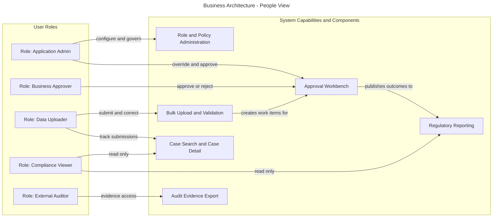

### 1.2 Process View

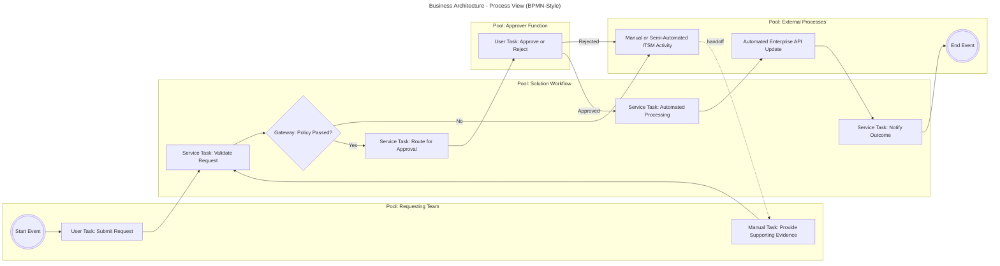

### 1.3 Functions View

```mermaid
---
title: Business Architecture - Functions View (Use Case Template)
---
flowchart LR
	subgraph Actors[Actors]
		A1[Admin]
		A2[Approver]
		A3[Uploader]
		A4[Viewer]
	end

	subgraph UseCases[Solution Use Cases]
		U1([Manage Roles and Policy Rules])
		U2([Upload and Validate Submission])
		U3([Approve or Reject Submission])
		U4([View Case and Status])
		U5([Generate Compliance Report])
		U6([Export Audit Evidence])
	end

	A1 --> U1
	A1 --> U3
	A2 --> U3
	A3 --> U2
	A3 --> U4
	A4 --> U4
	A4 --> U5
	A4 --> U6
	U2 -->|uses| U4
	U3 -->|updates| U4
	U5 -->|sources evidence from| U6
```

### 1.4 Information and Information Flows View

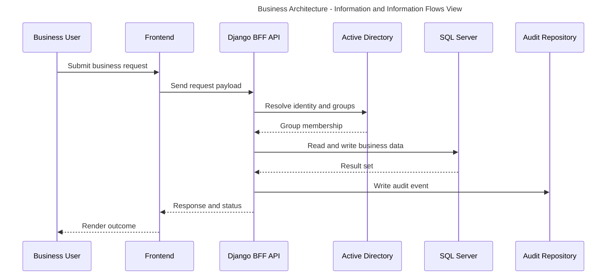

### 1.5 Usability View

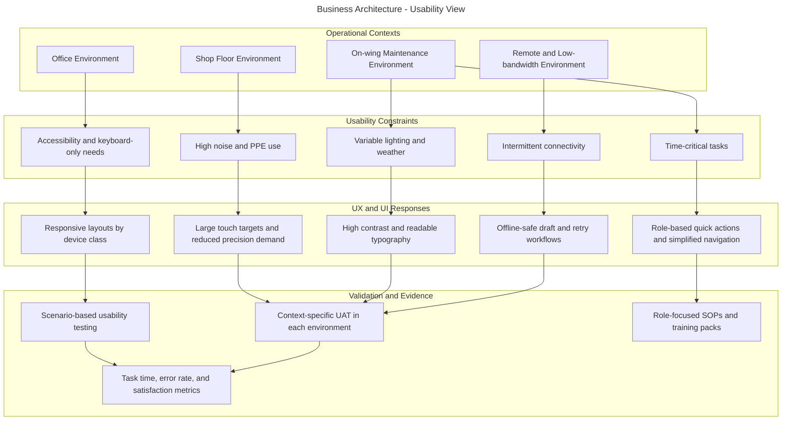

### 1.6 Performance View

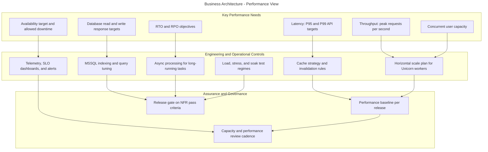

## 2. Data Architecture Views

### 2.1 Data Entity View

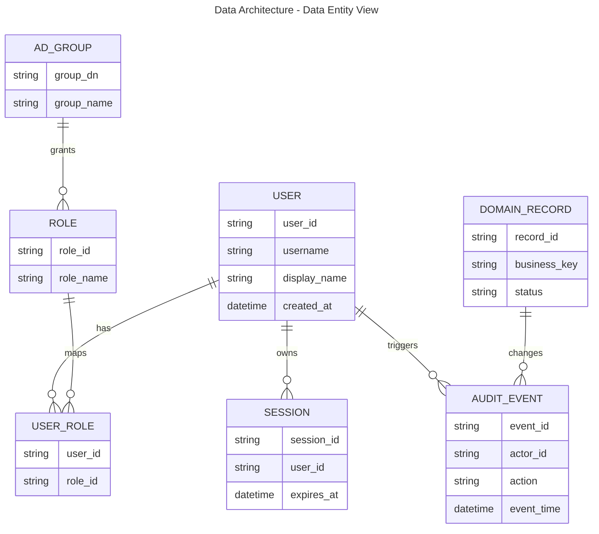

### 2.2 Data Security View

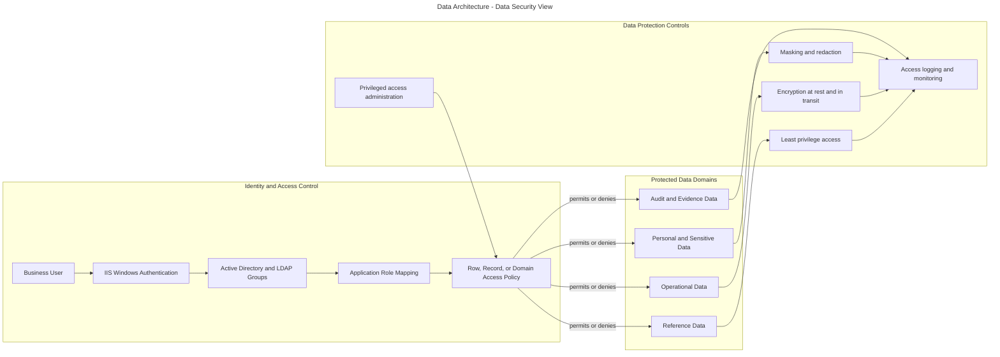

### 2.3 Data Flow View

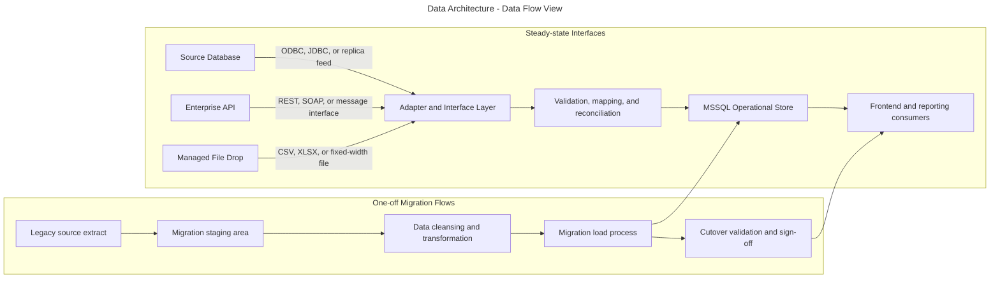

### 2.4 Logical Data Management View

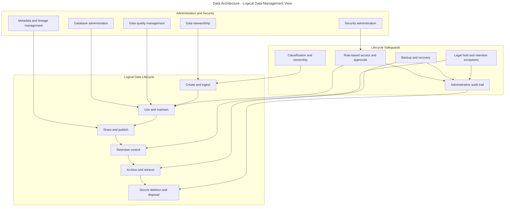

## 3. Applications Architecture Views

### 3.1 Logical Applications View

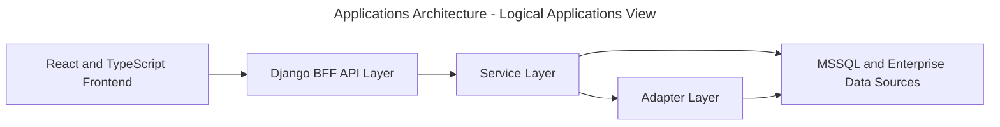

### 3.2 Physical Applications View

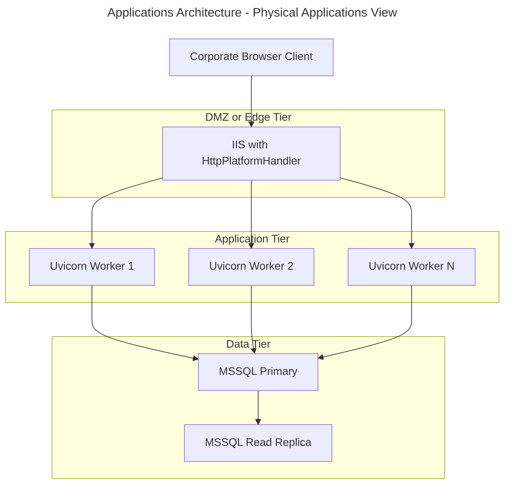

### 3.3 Integration and Interface View - BPE

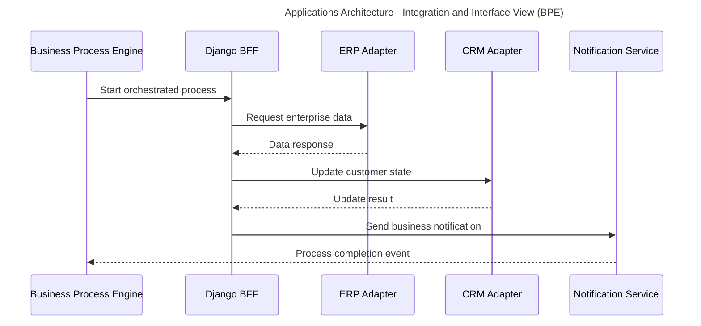

### 3.4 Integration and Interface View - ETL

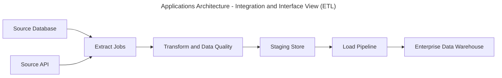

### 3.5 Integration and Interface View - EAI

```mermaid
---
title: Applications Architecture - Integration and Interface View (EAI)
---
flowchart LR
	App1[Line of Business App A]
	App2[Line of Business App B]
	App3[Line of Business App C]
	Bus[Enterprise Integration Bus]
	Canonical[Canonical Message Model]
	Rules[Routing and Transformation Rules]

	App1 <--> Bus
	App2 <--> Bus
	App3 <--> Bus
	Bus --> Canonical
	Bus --> Rules
```

### 3.6 Authorisation and Authentication View

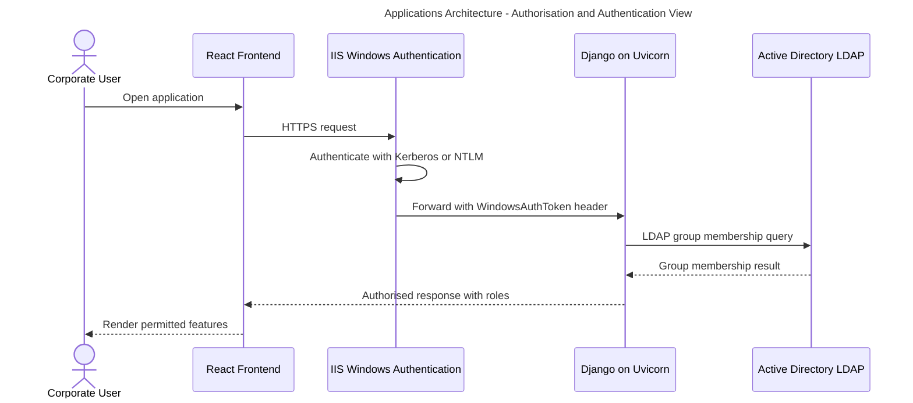

### 3.7 Applications Monitoring View

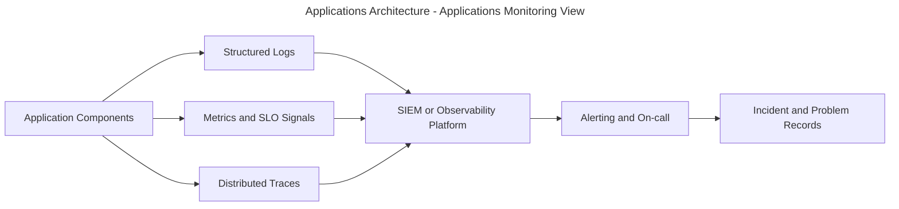

## 4. Technology Architecture Views

### 4.1 Network Topology View

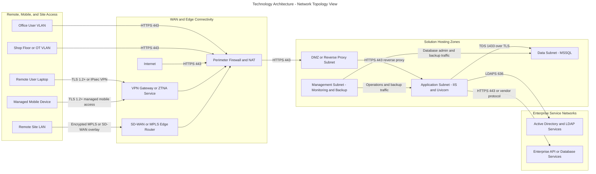

### 4.2 Internet Facing Servers View

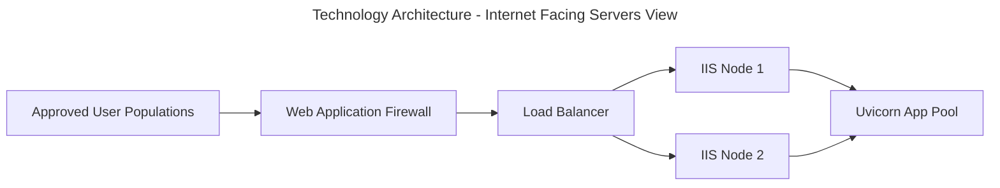

### 4.3 Traffic Volumes and Bandwidth View

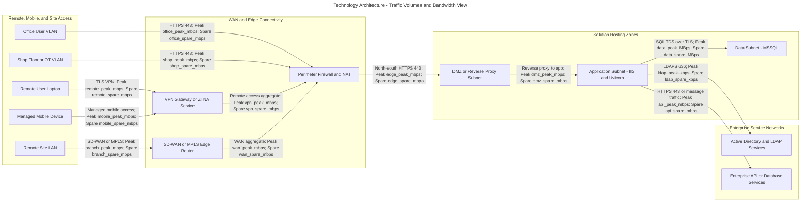

## 5. Client, Server and Storage View

```mermaid
---
title: Client, Server and Storage View
---
flowchart LR
	subgraph Clients[Client Tier]
		Browser[Managed Browser]
		Mobile[Managed Mobile Device]
	end

	subgraph Servers[Server Tier]
		IIS[IIS and HttpPlatformHandler]
		Uvicorn[Django and Uvicorn]
		Worker[Background Worker]
	end

	subgraph Storage[Storage Tier]
		SQL[MSSQL Database]
		Blob[Document and Object Storage]
		Backup[Backup Vault]
	end

	Browser --> IIS
	Mobile --> IIS
	IIS --> Uvicorn
	Uvicorn --> Worker
	Uvicorn --> SQL
	Uvicorn --> Blob
	SQL --> Backup
	Blob --> Backup
```

## 6. Systems Management View

### 6.1 Backup and Restore View

```mermaid
---
title: Systems Management View - Backup and Restore
---
flowchart LR
	subgraph ProtectedEstate[Protected Solution Estate]
		App[Application servers and middleware]
		DB[Databases]
		FileStore[File and object storage]
	end

	subgraph BackupPlatform[Backup and Recovery Mechanisms]
		Agent[Backup agents or snapshot integration]
		Policy[Backup policy and schedule]
		Vault[Primary backup repository]
		Offsite[Off-site or immutable copy]
		Catalog[Restore catalog and recovery runbooks]
		Test[Restore test and validation]
	end

	subgraph Governance[Recovery Governance]
		Ops[Operations and recovery team]
		ITSM[Incident, change, and recovery records]
		Targets[RTO and RPO targets]
	end

	App --> Agent
	DB --> Agent
	FileStore --> Agent
	Agent --> Policy --> Vault --> Offsite
	Vault --> Catalog
	Catalog --> Test
	Ops --> Catalog
	Targets --> Policy
	Targets --> Test
	Test --> ITSM
	Ops --> ITSM
```

### 6.2 Systems Archiving and Purging View

```mermaid
---
title: Systems Management View - Systems Archiving and Purging
---
flowchart LR
	subgraph Policy[Retention and Control Inputs]
		Classify[Data classification and ownership]
		Retention[Retention schedule and policy]
		Legal[Legal hold and exception handling]
		Approval[Business and records approval]
	end

	subgraph DataStores[Managed Data Stores]
		Operational[Operational data store]
		ArchiveStore[Archive storage tier]
		Purge[Approved purge and disposal job]
		Evidence[Archive and purge audit evidence]
	end

	subgraph Operations[Operational Controls]
		Select[Archiving and purge selection rules]
		Review[Archive and purge review]
		Hold[Legal hold prevents purge]
	end

	Classify --> Select
	Retention --> Select
	Operational --> Select
	Select -->|archive candidate set| ArchiveStore
	Select -->|purge candidate set| Review
	Approval --> Review
	Legal --> Hold
	Hold -. blocks .-> Review
	Review --> PurgeExec[Purge execution]
	PurgeExec --> Evidence
	ArchiveStore --> Evidence
```

### 6.3 Service, Application and Technology Monitoring and Alerting View

```mermaid
---
title: Systems Management View - Monitoring and Alerting
---
flowchart LR
	subgraph SignalSources[Service, Application, and Technology Signal Sources]
		Service[Service KPIs and user journeys]
		App[Application health and performance]
		DB[Database health and capacity]
		Infra[OS, VM, network, and storage telemetry]
		Synth[Synthetic probes]
	end

	subgraph Telemetry[Collection and Analysis]
		Metrics[Metrics collection]
		Logs[Central log platform]
		Traces[Tracing and APM]
		Rules[Thresholds, baselines, and anomaly rules]
	end

	subgraph Response[Response and Governance]
		Dash[Dashboards and service views]
		Alert[Alerts and escalation policies]
		Ops[Operations and on-call]
		ITSM[Incident, problem, and change records]
		Review[Capacity and service review]
	end

	Service --> Metrics
	App --> Metrics
	App --> Logs
	App --> Traces
	DB --> Metrics
	Infra --> Metrics
	Infra --> Logs
	Synth --> Rules
	Metrics --> Rules
	Logs --> Rules
	Traces --> Rules
	Metrics --> Dash
	Logs --> Dash
	Traces --> Dash
	Rules --> Alert --> Ops --> ITSM
	Dash --> Review
	ITSM --> Review
```

### 6.4 Systems Instrumentation View

```mermaid
---
title: Systems Management View - Systems Instrumentation
---
flowchart LR
	subgraph Components[Instrumented Components]
		Frontend[Frontend and user journey points]
		API[API and service layer]
		Adapter[Integration adapters]
		DB[Database tier]
		Host[OS, server, and platform layer]
	end

	subgraph Controls[Instrumentation Mechanisms]
		LogLib[Structured logging and audit hooks]
		MetricExp[Metric exporters]
		TraceCtx[Trace propagation and correlation IDs]
		Agent[Host agents and forwarders]
		Collector[Telemetry collector or gateway]
	end

	subgraph Consumers[Operational Consumers]
		Obs[Observability platform]
		SIEM[Security monitoring]
		Dash[Dashboards and reports]
	end

	Frontend --> MetricExp
	API --> LogLib
	API --> MetricExp
	API --> TraceCtx
	Adapter --> LogLib
	Adapter --> MetricExp
	Adapter --> TraceCtx
	DB --> Agent
	Host --> Agent
	LogLib --> Agent
	MetricExp --> Collector
	TraceCtx --> Collector
	Agent --> Collector
	Collector --> Obs
	Collector --> SIEM
	Obs --> Dash
```

### 6.5 Systems Maintenance Mechanisms View

```mermaid
---
title: Systems Management View - Systems Maintenance Mechanisms
---
flowchart LR
	subgraph Inputs[Maintenance Inputs and Governance]
		Vendor[Vendor advisories and approved packages]
		Vuln[Vulnerability and compliance findings]
		Change[Change calendar and maintenance windows]
		Baseline[Approved baselines and CMDB]
	end

	subgraph Maintenance[Maintenance Mechanisms]
		Repo[Patch and software repository]
		Dist[Software distribution tooling]
		Test[Non-production validation]
		Ring[Deployment rings or pilot groups]
		Rollback[Rollback and recovery plan]
	end

	subgraph Targets[Managed Targets]
		Endpoint[Client and admin endpoints]
		App[Application and middleware servers]
		DB[Database hosts]
		Tooling[Monitoring and management agents]
	end

	Vendor --> Repo
	Vuln --> Repo
	Baseline --> Test
	Repo --> Dist --> Test
	Test --> Ring
	Rollback --> Ring
	Change --> Ring
	Ring --> Endpoint
	Ring --> App
	Ring --> DB
	Ring --> Tooling
```

### 6.6 Supplier Remote Access View

```mermaid
---
title: Systems Management View - Supplier Remote Access
---
flowchart LR
	subgraph Request[Request and Approval]
		SupplierUser[Supplier engineer]
		Ticket[Support request or ticket]
		Approve[Customer approval and time-bound authorization]
		ServiceDesk[Service desk or duty manager]
	end

	subgraph AccessPath[Controlled Access Path]
		IdP[Identity provider and MFA]
		VPN[VPN or ZTNA service]
		PAM[Privileged access management]
		Jump[Jump host or bastion]
		Session[Recorded admin session]
	end

	subgraph Targets[Administrative Targets]
		App[Application servers]
		Infra[Platform and network administration endpoints]
		Mgmt[Management tooling]
	end

	subgraph Oversight[Oversight and Review]
		Log[Session logging and security monitoring]
		Review[Access review and revocation]
	end

	SupplierUser --> Ticket --> Approve
	ServiceDesk --> Approve
	Approve --> IdP --> VPN --> PAM --> Jump --> Session
	Session --> App
	Session --> Infra
	Session --> Mgmt
	Session --> Log
	PAM --> Review
	Log --> Review
```
