# TOGAF Documentation Mermaid Templates

Use these as starter templates for regulated enterprise documentation packs.
Replace placeholder labels (for example, `[System A]`, `[Owner]`, `[PII]`) with client-specific values.

## 1. Business Architecture Views

### 1.1 People View

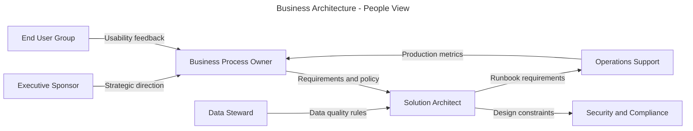

### 1.2 Process View

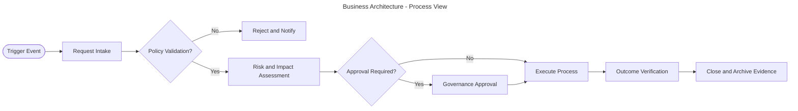

### 1.3 Functions View

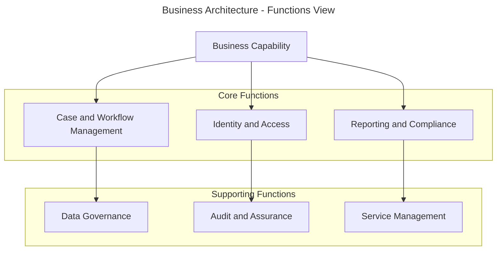

### 1.4 Information and Information Flows View

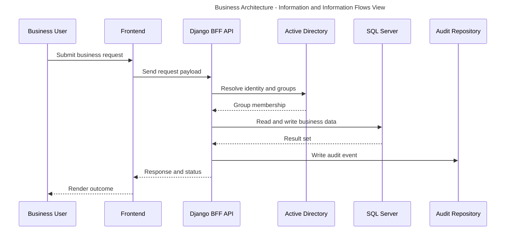

### 1.5 Usability View

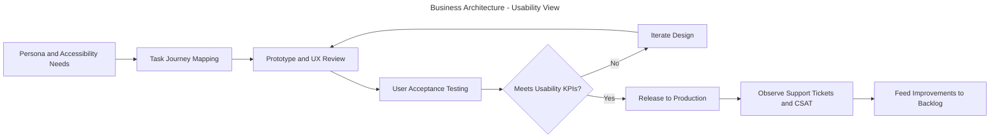

### 1.6 Performance View

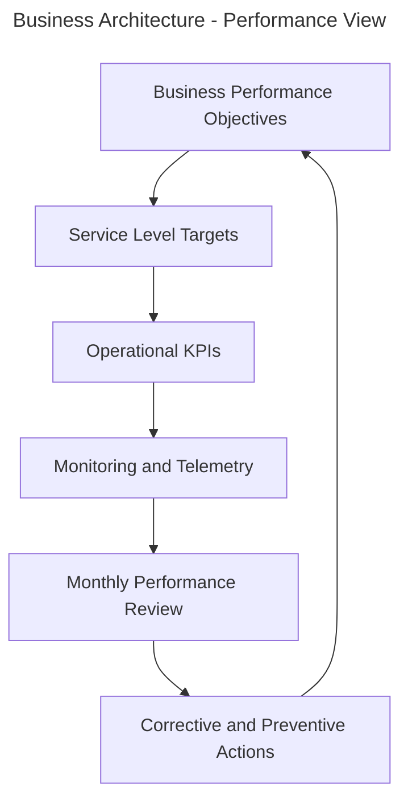

## 2. Data Architecture Views

### 2.1 Data Entity View

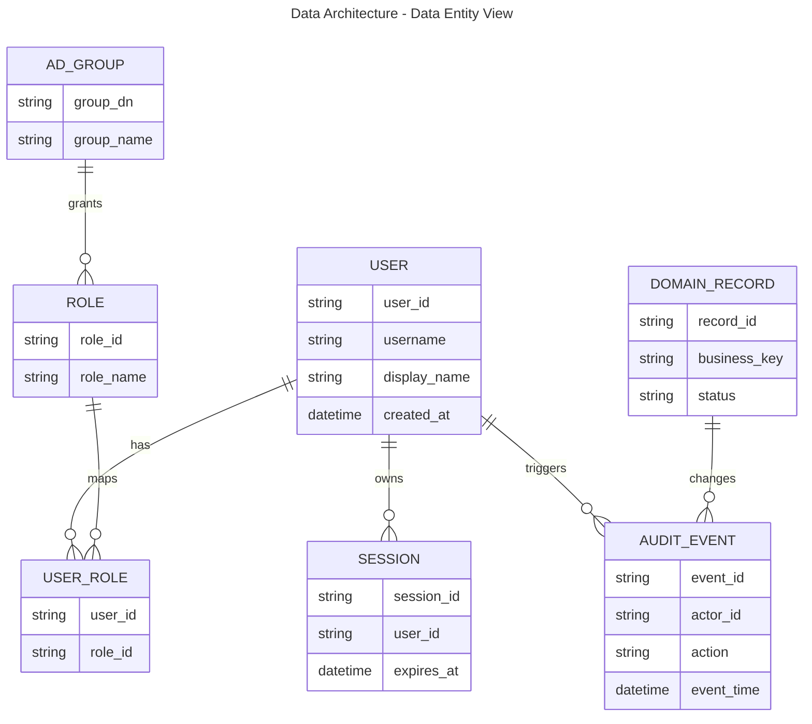

### 2.2 Data Security View

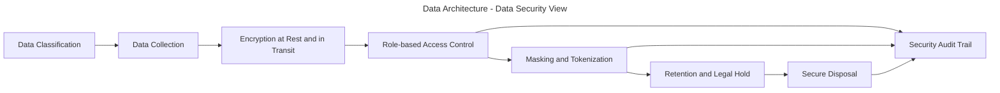

### 2.3 Data Flow View

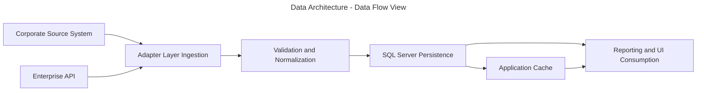

### 2.4 Logical Data Management View

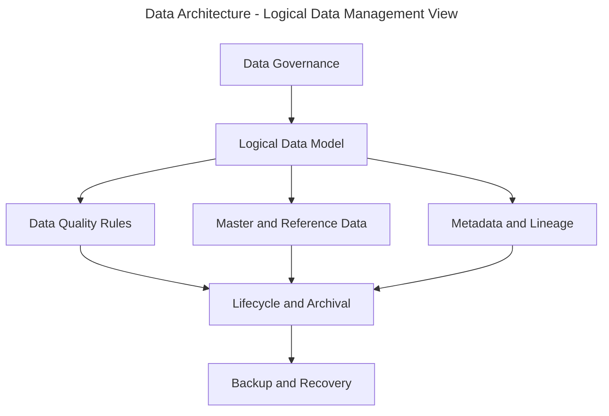

## 3. Applications Architecture Views

### 3.1 Logical Applications View

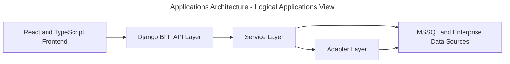

### 3.2 Physical Applications View

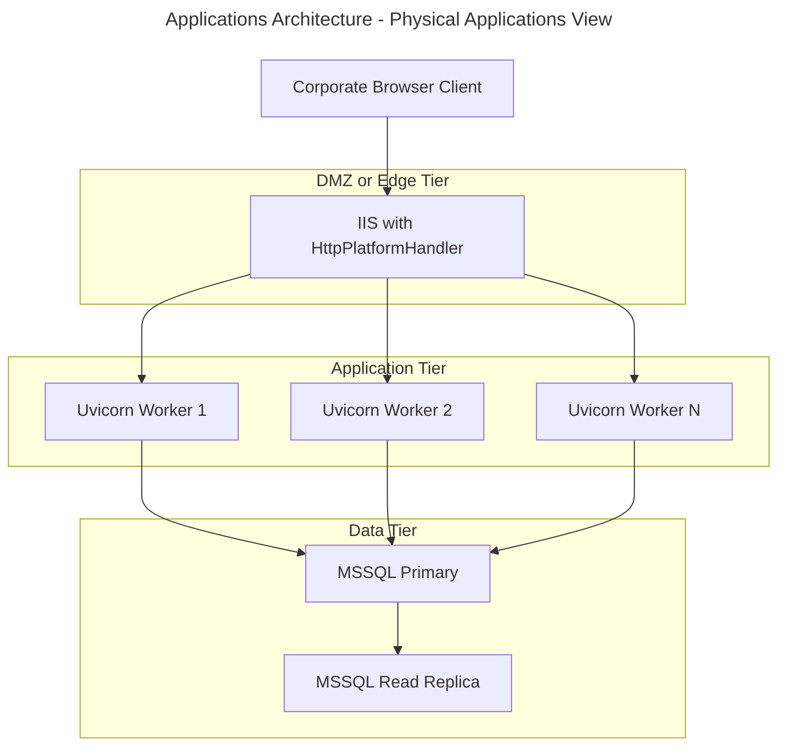

### 3.3 Integration and Interface View - BPE

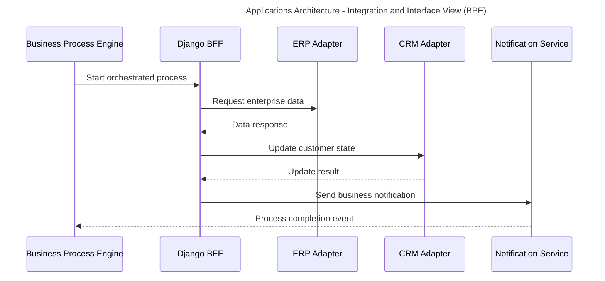

### 3.4 Integration and Interface View - ETL

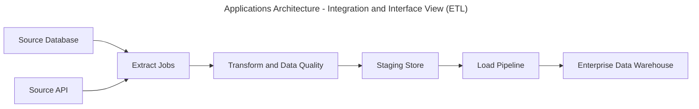

### 3.5 Integration and Interface View - EAI

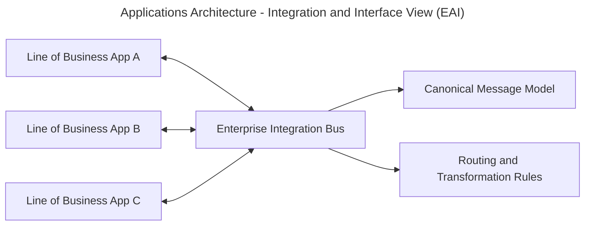

### 3.6 Authorisation and Authentication View

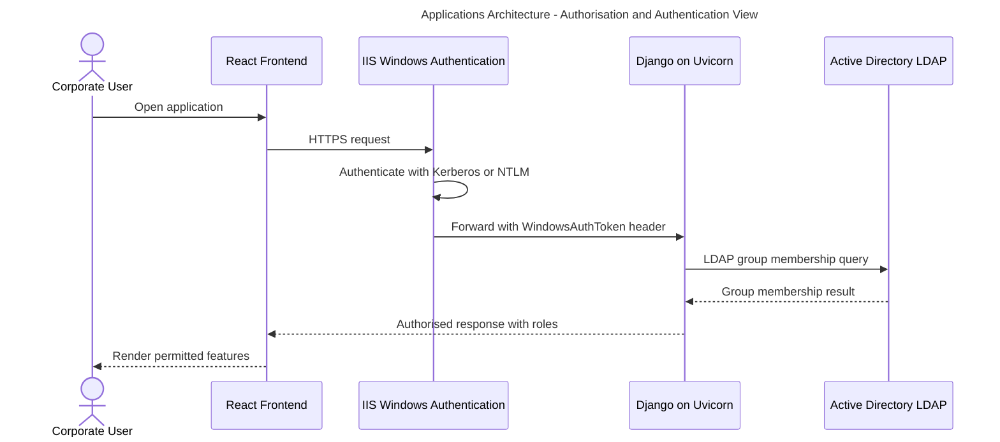

### 3.7 Applications Monitoring View

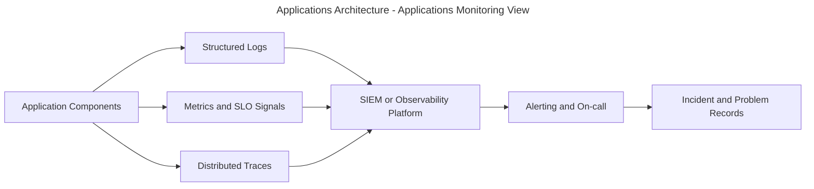

## 4. Technology Architecture Views

### 4.1 Network Topology View

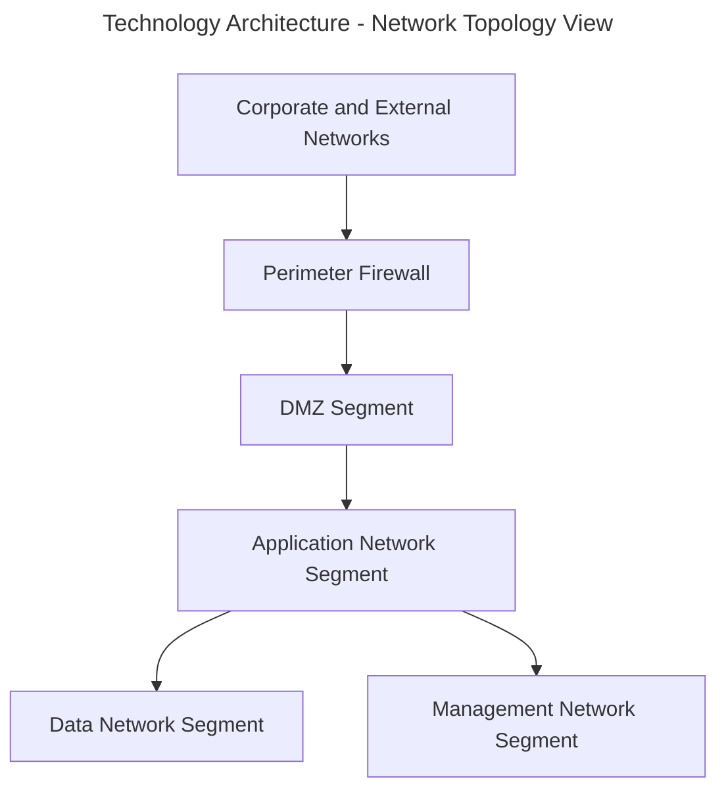

### 4.2 Internet Facing Servers View

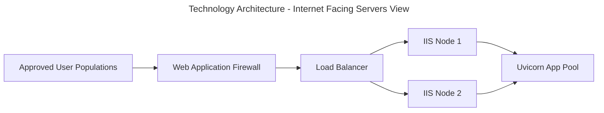

### 4.3 Traffic Volumes and Bandwidth View

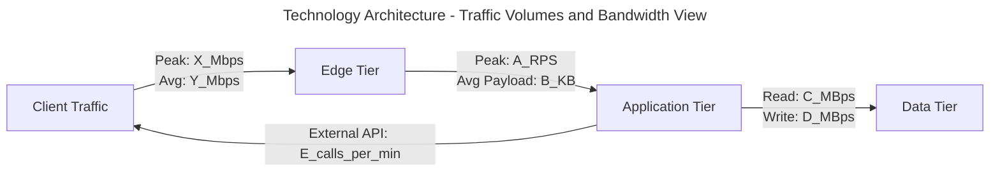

## 5. Client, Server and Storage View

```mermaid
---
title: Client, Server and Storage View
---
flowchart LR
	subgraph Clients[Client Tier]
		Browser[Managed Browser]
		Mobile[Managed Mobile Device]
	end

	subgraph Servers[Server Tier]
		IIS[IIS and HttpPlatformHandler]
		Uvicorn[Django and Uvicorn]
		Worker[Background Worker]
	end

	subgraph Storage[Storage Tier]
		SQL[MSSQL Database]
		Blob[Document and Object Storage]
		Backup[Backup Vault]
	end

	Browser --> IIS
	Mobile --> IIS
	IIS --> Uvicorn
	Uvicorn --> Worker
	Uvicorn --> SQL
	Uvicorn --> Blob
	SQL --> Backup
	Blob --> Backup
```

## 6. Systems Management View

```mermaid
---
title: Systems Management View
---
flowchart TB
	Monitor[Monitoring and Event Management]
	Incident[Incident Management]
	Problem[Problem Management]
	Change[Change and Release Management]
	Config[Configuration Management Database]
	Patch[Patch and Vulnerability Management]
	Continuity[Backup, Restore, and DR Testing]
	Compliance[Compliance Reporting and Evidence]

	Monitor --> Incident
	Incident --> Problem
	Problem --> Change
	Change --> Config
	Config --> Patch
	Patch --> Monitor
	Change --> Continuity
	Continuity --> Compliance
	Compliance --> Change
```
